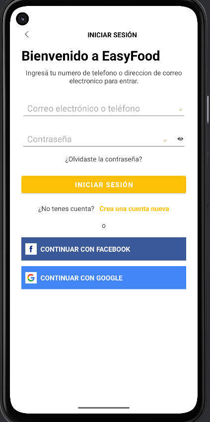
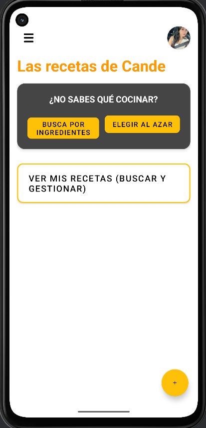
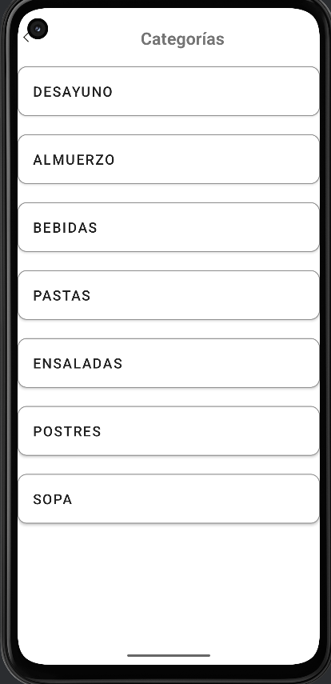
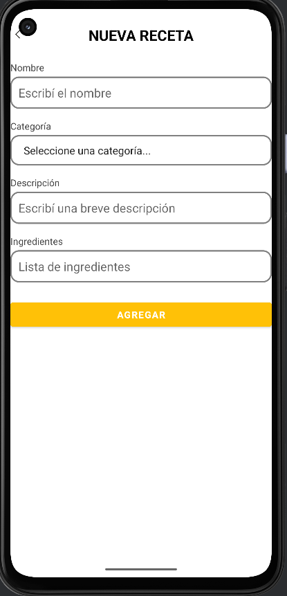

# 🍽️ EasyFood – App de Gestión de Recetas  
Aplicación móvil desarrollada en **Android Studio (Kotlin + XML)**, diseñada para organizar, buscar y gestionar recetas de cocina de forma rápida, intuitiva y totalmente offline gracias al uso de **SQLite**.

---

## Video demostración  
[ Ver video](https://drive.google.com/file/d/11kcMBSgLKmryikZOL3d15AtLwbdjLxE9/view?usp=drivesdk)
---

## Funcionalidades principales

### Autenticación de usuarios
- Registro de nuevos usuarios  
- Inicio de sesión con validación  
- Persistencia de datos en SQLite  
- Manejo seguro de credenciales

---

### Pantalla Principal
Accesos rápidos a:
- Buscar recetas por ingredientes  
- Ver categorías  
- Mis recetas  
- Receta al azar  
- Agregar receta  
- Menú lateral  
- Cierre de sesión con confirmación  

---

### Gestión completa de recetas
- Crear receta  
- Editar recetas existentes  
- Eliminar con confirmación  
- Ver detalles de cada receta  
- Buscador en tiempo real  
- Marcado de favoritos (simulado)  

---

### Búsqueda inteligente por ingredientes
El usuario puede ingresar ingredientes separados por:
- comas  
- punto y coma  
- saltos de línea  

El sistema devuelve recetas que **contengan al menos uno** de los ingredientes.

---

### Exploración por categorías
Incluye:
- Desayuno  
- Almuerzo  
- Bebidas  
- Pastas  
- Ensaladas  
- Postres  
- Sopas  

Con scroll horizontal y centrado automático del botón seleccionado.

---

### Base de datos local (SQLite)
- CRUD completo  
- Consultas por nombre  
- Consultas por categoría  
- Consultas por ingrediente  
- Receta aleatoria  
- Manejo seguro de cursores  
- Excepciones controladas  

---

## Tecnologías utilizadas

### **Frontend (Android)**
- Kotlin  
- XML  
- Material Design  
- ConstraintLayout  
- LinearLayout  

### **Backend local**
- SQLite  
- SQLiteOpenHelper  
- Consultas SQL personalizadas  

### **Extras**
- RecyclerView + Adapter personalizado  
- Snackbar  
- Toast  
- AlertDialog  
- Intents  
- Manejo de estado en tiempo real  

---

## Prototipado en Figma  
[ Ver prototipo en Figma](https://www.figma.com/file/YRpEjsdKFJiLMkl9NYUPKz?node-id=0%3A1)

---

## Capturas de pantalla de la Aplicación

  
  
  
  

  
  
  

</em>

---

## 👩‍💻 Autora

**Candela Godoy**  
Desarrollado en la Tecnicatura Universitaria en Programación de Sistemas – UCES  

